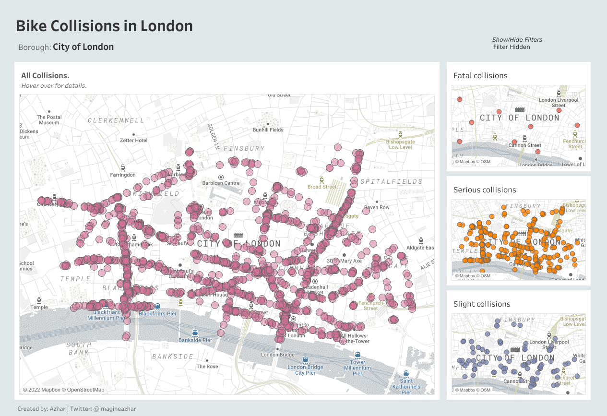

# 30DayMapChallenge

My contributions to the [#30DayMapChallenge 2022](https://twitter.com/tjukanov/status/1576650170535936001?s=20&t=YH8ZcCe1Mf5W2E-hugYRXg)  by Topi Tjukanov.

  
Contributions in chronological order (click to expand)

<!-- toc -->

**Maps**

* Day 01: [Points](contributions/Day01_Points)
* Day 02: [Lines](contributions/02-Lines)
* Day 03: [Polygons](contributions/03-polygons)
* Day 04: [Green](contributions/04-Green)
* Day 05: [Ukraine](https://public.tableau.com/app/profile/m.azhar/viz/UkrainePorts30DayMapChallenge/ports)
* Day 06: [Network](contributions/06-Network)
* Day 07: [Raster](contributions/07-Raster)
* Day 08: [OpenStreetMap](contributions/08-OpenStreetMap)

***

### Day 01 | [Points](https://public.tableau.com/app/profile/m.azhar/viz/BikeCollisionsinLondon30DaysMapChallengePoints/Day_01Points)

***OpenStreetMap

### Day 02 | [lines](contributions/02-Lines/)

***

### Day 03 | [Polygon](contributions/03-polygons)

***

### Day 04 | [Green](contributions/04-Green)

***

### Day 05 | [Ukraine](https://public.tableau.com/app/profile/m.azhar/viz/UkrainePorts30DayMapChallenge/ports)

***

### Day 06 | [Network](contributions/06-Network/)

***

### Day 07 | [Raster](contributions/07-Raster)

***

### Day 08 | [OpenStreetMap](contributions/08-OpenStreetMap)

***
